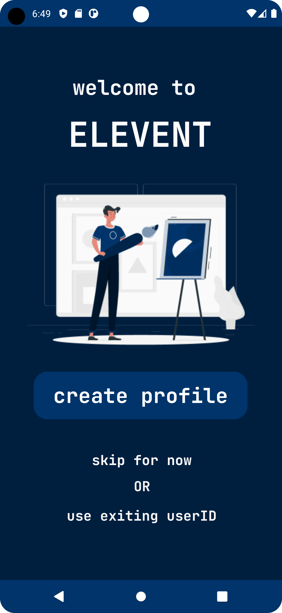

# Elevent
Hello, and elcome to Elevent! 

Elevent is a Java-based event creation and joining platform. Users can create events, join existing ones, manage event details, share events via QR codes, and update their profiles. The app is designed to make event management simple and accessible for everyone.

## Features Overview

- Create and manage events
- Join existing events
- View event details
- Share events via QR codes
- User profile management

## Screenshots and Walkthrough

### 1. Landing Page
The landing page is the first screen a user encounters upon opening the app for the first time. It introduces the app and its purpose.

### 2. All Events Page
This page lists all available events that a user can browse and join.

### 3. Event Details Page
Clicking on an event from the All Events page takes the user to a detailed view of the event, where they can see more information and decide whether to join.

### 4. My Events Page
The My Events page shows all the events created by the user, allowing them to manage and keep track of their events.

### 5. Create an Event Page
Users can create a new event by filling out the necessary details in this two-step process. The app also generates QR codes automatically for event promotion and check-ins.

### 6. Manage Event Page
After creating an event, users can manage it from this page. They can send notifications and messages to attendees.

### 7. Share Event Page
Users can easily share their events through a pop-up page that displays a QR code and options for sharing it via various apps.

### 8. User Profile Page
This page displays the user’s profile information, including their name, email, and event participation history.

### 9. Edit Profile Page
Users can edit their profile information by accessing this page from their profile.

### 10. Updated User Profile Page
Once a user updates their profile, the changes are reflected here.

## Technology Stack

- **Java:** The core programming language for developing the app.
- **Libraries/Frameworks:** 

## Contributing

Contributions are welcome! Please fork the repository and submit a pull request for any improvements or features you'd like to add.

## License

This project is licensed under the MIT License - see the [LICENSE](LICENSE) file for details.

